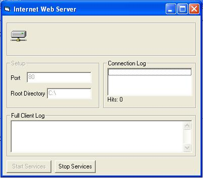



## Simple \(but full\) Webserver III

### Description

This is a simple webserver I made just to demonstrate how a webserver sends and recieves information from the client. This webserver allows you to configure the port to listen on and your home directory. The default document is set to be index.html, but you can change that under the winsock1_dataarival(...). It also featues a graphical representation of the computers that connect to you and a progress bar for transfers. This webserver has a simple IP log which shows the IP addresses of those who connect to you, and a more sophisticated log which shows all the information that the client sends to you. If you like this, please vote for me :) --"if only one man in the world could see and the rest were blind, they'd say he's crazy too"--
 
### More Info
 

             |
---                |---
**Submitted On**   |2002-04-01 20:58:42
**By**             |[Matt Carpenter](https://github.com/Planet-Source-Code/PSCIndex/blob/master/ByAuthor/matt-carpenter.md)
**Level**          |Advanced
**User Rating**    |4.3 (13 globes from 3 users)
**Compatibility**  |VB 6\.0
**Category**       |[Internet/ HTML](https://github.com/Planet-Source-Code/PSCIndex/blob/master/ByCategory/internet-html__1-34.md)
**World**          |[Visual Basic](https://github.com/Planet-Source-Code/PSCIndex/blob/master/ByWorld/visual-basic.md)
**Archive File**   |[Simple\_\(bu69487462002\.zip](https://github.com/Planet-Source-Code/matt-carpenter-simple-but-full-webserver-iii__1-33533/archive/master.zip)

